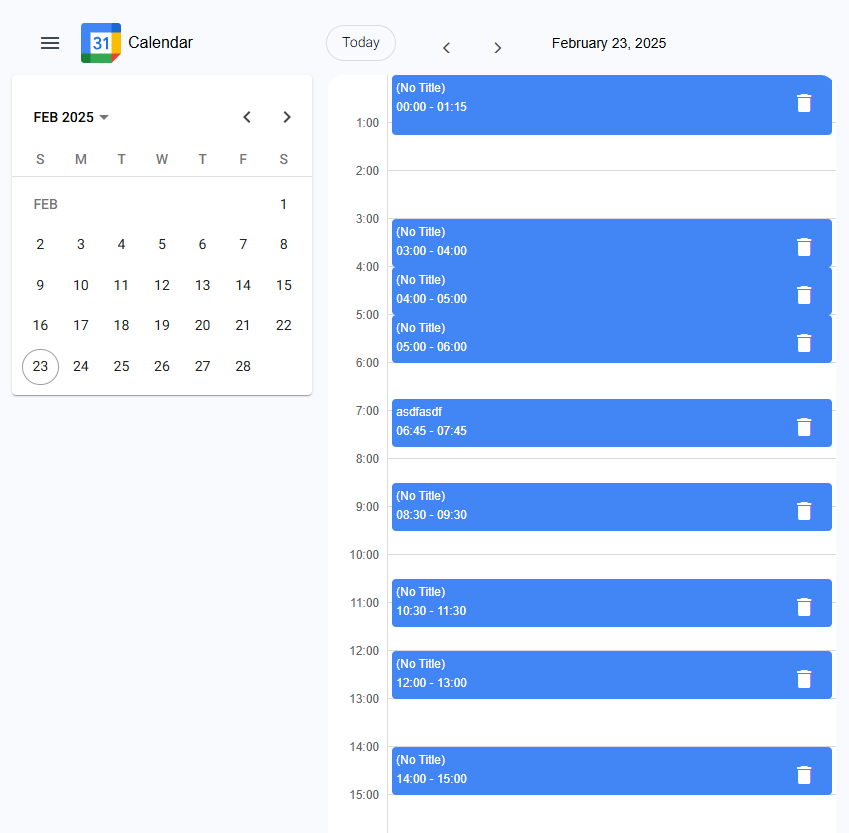
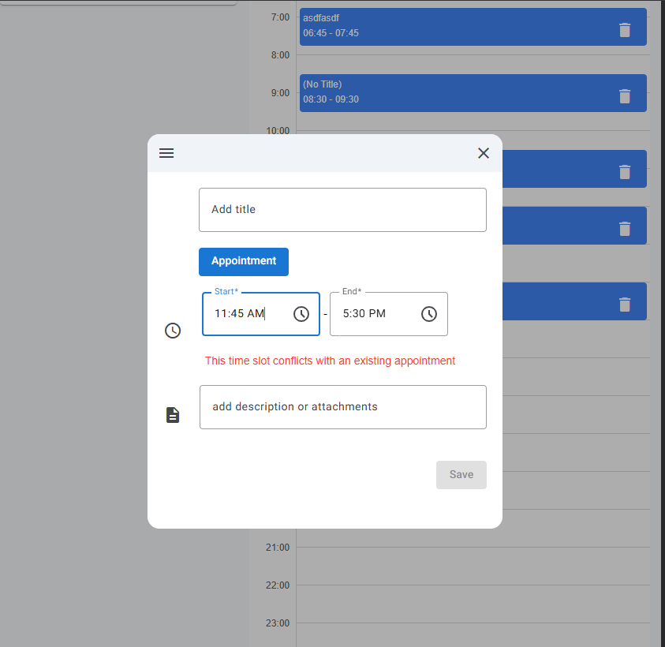

# Calendar Application



A modern, responsive calendar application built with Angular, featuring drag-and-drop appointment management and a clean, intuitive interface.

## Features

- 📅 Day view calendar with 15-minute interval slots
- ✏️ Create, edit, and delete appointments
- 🎯 Drag & drop appointment rescheduling
- 🚫 Smart conflict detection to prevent double-booking
- 📱 Responsive design that works on all devices
- 🎨 Clean, modern UI using Angular Material



## Technical Highlights

- Built with Angular 19 and TypeScript
- Uses Angular Material for UI components
- Implements Angular CDK for drag & drop functionality
- Features reactive state management with Signals
- Follows modern Angular best practices:
  - Standalone components
  - Lazy loading
  - Dependency injection
  - Custom form validators
  - RXJS usage
  - Type safety

## Project Structure

```
src/
├── app/
│   ├── features/
│   │   └── calendar/         # Main calendar feature
│   │       ├── components/   # Reusable calendar components
│   │       └── features/     # Sub-features (day view, etc.)
│   ├── services/            # Application services
│   ├── models/             # TypeScript interfaces
│   └── enums/              # TypeScript enums
└── assets/                # Static assets
```

## Getting Started

1. Install dependencies:
   ```bash
   npm install
   ```

2. Start the development server:
   ```bash
   npm start
   ```

3. Open your browser and navigate to `http://localhost:4200`

## Development Decisions

- Used Angular Material and CDK to ensure consistent UI and robust drag & drop
- Implemented standalone components for better tree-shaking
- Used signals for state management to reduce complexity
- Added custom validators for appointment conflicts
- Structured the app for scalability with feature modules
- Focused on maintainable, well-documented code

## Future Improvements

- Add week and month views
- Implement recurring appointments
- Add appointment categories and colors
- Include search functionality
- Add unit and e2e tests
- Implement appointment reminders

## Notes

This project was developed as part of a technical assessment. While it meets all requirements, there's always room for improvement and additional features. Feel free to explore the code and suggest improvements!
